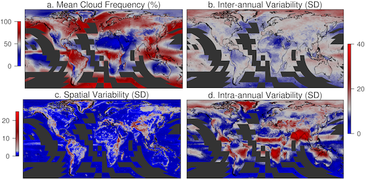
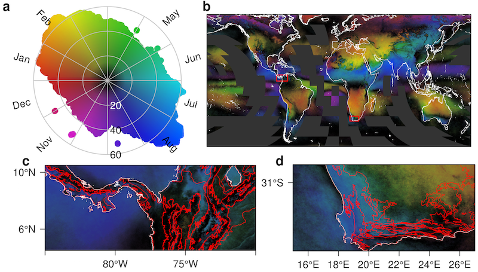
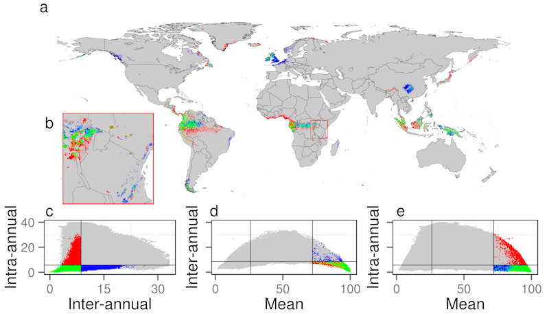

Global 1-km Cloud Cover
-----------------------

<iframe style="float:right;margin:20px;border:1pt solid gray; min-width:500px" src="http://cloud.map-of-life.appspot.com/"
name="map" frameborder="0" width="75%" height="700" allowfullscreen="true">
</iframe>
The datasets integrate 15 years of twice-daily remote sensing-derived cloud observations at 1-km resolution. For additional information about the integration approach and the evaluations of the datasets, please see the associated journal article:

Wilson AM, Jetz W (2016) Remotely Sensed High-Resolution Global Cloud Dynamics for Predicting Ecosystem and Biodiversity Distributions. PLoS Biol 14(3): e1002415. doi:10.1371/journal. pbio.1002415

{:.extra-spacing}
### Dataset Details

Cloud cover can influence numerous important ecological processes including reproduction, growth, survival, and behavior, yet our assessment of its importance at the appropriate spatial scales has remained remarkably limited. If captured over large extent yet at sufficiently fine spatial grain cloud cover dynamics may provide key information for delineating a variety of habitat types and predicting species distributions. Here we develop new near-global, fine-grain (≈1km) monthly cloud frequencies from 15 years of twice-daily MODIS satellite images that expose spatio-temporal cloud cover dynamics of previously undocumented global complexity. We demonstrate that cloud cover varies strongly in its geographic heterogeneity and that the direct, observation-based nature of cloud-derived metrics can improve predictions of habitats, ecosystem, and species distributions with reduced spatial autocorrelation compared to commonly used interpolated climate data. These findings support the fundamental role of remote sensing as an effective lens through which to understand and globally monitor the fine-grain spatial variability of key biodiversity and ecosystem properties. 

{:.table .table-bordered .table-condensed .datalayers .extra-spacing}
| Dataset Download                         |                                                                                         |
|------------------------------------------|-----------------------------------------------------------------------------------------|
| Cloud Forest Prediction                  | [Download GeoTIFF](http://data.earthenv.org/cloud/MODCF_CloudForestPrediction.tif){:.btn .btn-default .btn-xs}      |
| Inter-Annual SD                          | [Download GeoTIFF](http://data.earthenv.org/cloud/MODCF_interannualSD.tif){:.btn .btn-default .btn-xs}              |
| Intra-Annual SD                          | [Download GeoTIFF](http://data.earthenv.org/cloud/MODCF_intraannualSD.tif){:.btn .btn-default .btn-xs}              |
| Mean Annual                              | [Download GeoTIFF](http://data.earthenv.org/cloud/MODCF_meanannual.tif){:.btn .btn-default .btn-xs}                 |
| January Mean                             | [Download GeoTIFF](http://data.earthenv.org/cloud/MODCF_monthlymean_01.tif){:.btn .btn-default .btn-xs}            |
| February Mean                            | [Download GeoTIFF](http://data.earthenv.org/cloud/MODCF_monthlymean_02.tif){:.btn .btn-default .btn-xs}            |
| March Mean                               | [Download GeoTIFF](http://data.earthenv.org/cloud/MODCF_monthlymean_03.tif){:.btn .btn-default .btn-xs}            |
| April Mean                               | [Download GeoTIFF](http://data.earthenv.org/cloud/MODCF_monthlymean_04.tif){:.btn .btn-default .btn-xs}            |
| May Mean                                 | [Download GeoTIFF](http://data.earthenv.org/cloud/MODCF_monthlymean_05.tif){:.btn .btn-default .btn-xs}            |
| June Mean                                | [Download GeoTIFF](http://data.earthenv.org/cloud/MODCF_monthlymean_06.tif){:.btn .btn-default .btn-xs}            |
| July Mean                                | [Download GeoTIFF](http://data.earthenv.org/cloud/MODCF_monthlymean_07.tif){:.btn .btn-default .btn-xs}            |
| August Mean                              | [Download GeoTIFF](http://data.earthenv.org/cloud/MODCF_monthlymean_08.tif){:.btn .btn-default .btn-xs}            |
| September Mean                           | [Download GeoTIFF](http://data.earthenv.org/cloud/MODCF_monthlymean_09.tif){:.btn .btn-default .btn-xs}            |
| October Mean                             | [Download GeoTIFF](http://data.earthenv.org/cloud/MODCF_monthlymean_10.tif){:.btn .btn-default .btn-xs}            |
| November Mean                            | [Download GeoTIFF](http://data.earthenv.org/cloud/MODCF_monthlymean_11.tif){:.btn .btn-default .btn-xs}            |
| December Mean                            | [Download GeoTIFF](http://data.earthenv.org/cloud/MODCF_monthlymean_12.tif){:.btn .btn-default .btn-xs}            |
| Seasonality Concentration                | [Download GeoTIFF](http://data.earthenv.org/cloud/MODCF_seasonality_concentration.tif){:.btn .btn-default .btn-xs} |
| Seasonality RGB                          | [Download GeoTIFF](http://data.earthenv.org/cloud/MODCF_seasonality_rgb.tif){:.btn .btn-default .btn-xs}           |
| Seasonality Theta                        | [Download GeoTIFF](http://data.earthenv.org/cloud/MODCF_seasonality_theta.tif){:.btn .btn-default .btn-xs}         |
| Seasonality single band with color table | [Download GeoTIFF](http://data.earthenv.org/cloud/MODCF_seasonality_visct.tif){:.btn .btn-default .btn-xs}         |
| Spatial SD (1 degree)                    | [Download GeoTIFF](http://data.earthenv.org/cloud/MODCF_spatialSD_1deg.tif){:.btn .btn-default .btn-xs}            |

{:#slideshowimages .extra-spacing}
* 
* 
* 

{:.extra-spacing}
### Distribution

 EarthEnv Global 1-km Cloud Frequency Version 1 by Wilson & Jetz is licensed under a <a rel="license" href="http://creativecommons.org/licenses/by-nc/4.0/">Creative Commons Attribution-NonCommercial 4.0 International License</a>. Permissions beyond the scope of this license may be available at <a xmlns:cc="http://creativecommons.org/ns#" href="http://www.earthenv.org/cloud.html" rel="cc:morePermissions">http://www.earthenv.org/cloud.html</a>.

{:.extra-spacing}
### Dataset Citation

"Wilson AM, Jetz W (2016) Remotely Sensed High-Resolution Global Cloud Dynamics for Predicting Ecosystem and Biodiversity Distributions. PLoS Biol 14(3): e1002415. doi:10.1371/journal. pbio.1002415"
Data available on-line at <http://www.earthenv.org/>.

{:.extra-spacing}
### Contacts

* [Adam M. Wilson](http://adamwilson.us)
* [Walter Jetz](http://jetzlab.yale.edu/people/walter-jetz)

<!-- Load the ulSlide jQuery plugin. -->

