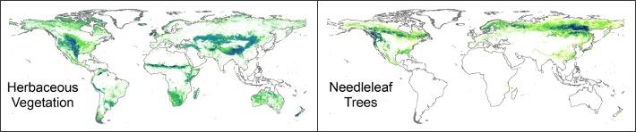
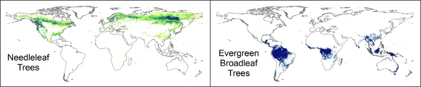
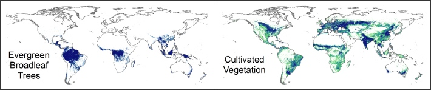
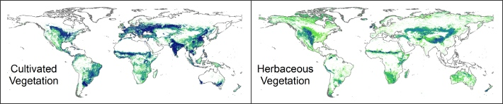

Global 1-km Consensus Land Cover
--------------------------------

{:#slideshowimages .extra-spacing}
* 
* 
* 
* 

{:.extra-spacing}
The datasets integrate multiple global remote sensing-derived land-cover products and provide consensus information on the prevalence of 12 land-cover classes at 1-km resolution. For additional information about the integration approach and the evaluations of the datasets, please see the associated journal article:

{:.litreference}
[Tuanmu, M.-N. and W. Jetz. 2014. A global 1-km consensus land-cover product for biodiversity and ecosystem modeling. Global Ecology and Biogeography 23(9): 1031-1045](http://onlinelibrary.wiley.com/doi/10.1111/geb.12182/abstract).

{:.extra-spacing}
### Dataset Details

Two versions of the consensus land-cover datasets are available. The full version is the dataset integrating GlobCover (2005-06; v2.2), the MODIS land-cover product (MCD12Q1; v051), GLC2000 (global product; v1.1), and DISCover (GLCC; v2). The reduced version is the dataset integrating the first three products only (i.e., without DISCover).

Each dataset contains 12 data layers, each of which provides consensus information on the prevalence of one land-cover class. All data layers contain unsigned 8-bit values and the valid values range from 0-100, representing the consensus prevalence in percentage. All data layers have a spatial extent from 90ºN - 56ºS and from 180ºW - 180ºE, and have a spatial resolution of 30 arc-second per pixel (~1 km per pixel at the equator).

{:.extra-spacing}
### Dataset Download

The datasets can be downloaded in the GeoTiff format for individual land-cover classes (20~100MB each).

{:.extra-spacing}
**Full Version 1.0 (with DISCover)**

{:#landcoverfull .table-bordered .datalayers}
| Class | Description                          | Download options                                                                                                                                                                                                                                                                                                                                                                                                                                                            |
|-------|--------------------------------------|-----------------------------------------------------------------------------------------------------------------------------------------------------------------------------------------------------------------------------------------------------------------------------------------------------------------------------------------------------------------------------------------------------------------------------------------------------------------------------|
| 1     | Evergreen/Deciduous Needleleaf Trees | [Download GeoTIFF](http://data.earthenv.org/consensus_landcover/with_DISCover/consensus_full_class_1.tif){:.btn .btn-default .btn-xs} [View/download by region](http://litoria.eeb.yale.edu:8080/las/UI.vm#panelHeaderHidden=false;xCATID=id-d169fb13f3;xDSID=id-d169fb13f3;varid=Band1-id-d169fb13f3;imageSize=auto;over=xy;compute=Nonetoken;catid=id-d169fb13f3;dsid=id-d169fb13f3;varid=Band1-id-d169fb13f3;avarcount=0;xlo=-170;xhi=159;ylo=-56;yhi=90;operation_id=Plot_2D_XY_zoom;view=xy){:.btn .btn-default .btn-xs}   |
| 2     | Evergreen Broadleaf Trees            | [Download GeoTIFF](http://data.earthenv.org/consensus_landcover/with_DISCover/consensus_full_class_2.tif){:.btn .btn-default .btn-xs} [View/download by region](http://litoria.eeb.yale.edu:8080/las/UI.vm#panelHeaderHidden=false;xCATID=id-d169fb13f3;xDSID=id-d169fb13f33;varid=Band1-id-c150881359;imageSize=auto;over=xy;compute=Nonetoken;catid=id-d169fb13f3;dsid=id-d169fb13f3;varid=Band1-id-c150881359;avarcount=0;xlo=-170;xhi=159;ylo=-56;yhi=90;operation_id=Plot_2D_XY_zoom;view=xy){:.btn .btn-default .btn-xs}  |
| 3     | Deciduous Broadleaf Trees            | [Download GeoTIFF](http://data.earthenv.org/consensus_landcover/with_DISCover/consensus_full_class_3.tif){:.btn .btn-default .btn-xs} [View/download by region](http://litoria.eeb.yale.edu:8080/las/UI.vm#panelHeaderHidden=false;xCATID=id-d169fb13f3;xDSID=id-d169fb13f33;varid=Band1-id-d543c09af1;imageSize=auto;over=xy;compute=Nonetoken;catid=id-d169fb13f3;dsid=id-d169fb13f3;varid=Band1-id-d543c09af1;avarcount=0;xlo=-170;xhi=159;ylo=-56;yhi=90;operation_id=Plot_2D_XY_zoom;view=xy){:.btn .btn-default .btn-xs}  |
| 4     | Mixed/Other Trees                    | [Download GeoTIFF](http://data.earthenv.org/consensus_landcover/with_DISCover/consensus_full_class_4.tif){:.btn .btn-default .btn-xs} [View/download by region](http://litoria.eeb.yale.edu:8080/las/UI.vm#panelHeaderHidden=false;xCATID=id-d169fb13f3;xDSID=id-d169fb13f33;varid=Band1-id-71ae73a39f;imageSize=auto;over=xy;compute=Nonetoken;catid=id-d169fb13f3;dsid=id-d169fb13f3;varid=Band1-id-71ae73a39f;avarcount=0;xlo=-170;xhi=159;ylo=-56;yhi=90;operation_id=Plot_2D_XY_zoom;view=xy){:.btn .btn-default .btn-xs}  |
| 5     | Shrubs                               | [Download GeoTIFF](http://data.earthenv.org/consensus_landcover/with_DISCover/consensus_full_class_5.tif){:.btn .btn-default .btn-xs} [View/download by region](http://litoria.eeb.yale.edu:8080/las/UI.vm#panelHeaderHidden=false;xCATID=id-d169fb13f3;xDSID=id-d169fb13f33;varid=Band1-id-a36cabac09;imageSize=auto;over=xy;compute=Nonetoken;catid=id-d169fb13f3;dsid=id-d169fb13f3;varid=Band1-id-a36cabac09;avarcount=0;xlo=-170;xhi=159;ylo=-56;yhi=90;operation_id=Plot_2D_XY_zoom;view=xy){:.btn .btn-default .btn-xs}  |
| 6     | Herbaceous Vegetation                | [Download GeoTIFF](http://data.earthenv.org/consensus_landcover/with_DISCover/consensus_full_class_6.tif){:.btn .btn-default .btn-xs} [View/download by region](http://litoria.eeb.yale.edu:8080/las/UI.vm#panelHeaderHidden=false;xCATID=id-d169fb13f3;xDSID=id-d169fb13f33;varid=Band1-id-1ca094be19;imageSize=auto;over=xy;compute=Nonetoken;catid=id-d169fb13f3;dsid=id-d169fb13f3;varid=Band1-id-1ca094be19;avarcount=0;xlo=-170;xhi=159;ylo=-56;yhi=90;operation_id=Plot_2D_XY_zoom;view=xy){:.btn .btn-default .btn-xs}  |
| 7     | Cultivated and Managed Vegetation    | [Download GeoTIFF](http://data.earthenv.org/consensus_landcover/with_DISCover/consensus_full_class_7.tif){:.btn .btn-default .btn-xs} [View/download by region](http://litoria.eeb.yale.edu:8080/las/UI.vm#panelHeaderHidden=false;xCATID=id-d169fb13f3;xDSID=id-d169fb13f33;varid=Band1-id-617605b5d0;imageSize=auto;over=xy;compute=Nonetoken;catid=id-d169fb13f3;dsid=id-d169fb13f3;varid=Band1-id-617605b5d0;avarcount=0;xlo=-170;xhi=159;ylo=-56;yhi=90;operation_id=Plot_2D_XY_zoom;view=xy){:.btn .btn-default .btn-xs}  |
| 8     | Regularly Flooded Vegetation         | [Download GeoTIFF](http://data.earthenv.org/consensus_landcover/with_DISCover/consensus_full_class_8.tif){:.btn .btn-default .btn-xs} [View/download by region](http://litoria.eeb.yale.edu:8080/las/UI.vm#panelHeaderHidden=false;xCATID=id-d169fb13f3;xDSID=id-d169fb13f33;varid=Band1-id-31a3aa59f9;imageSize=auto;over=xy;compute=Nonetoken;catid=id-d169fb13f3;dsid=id-d169fb13f3;varid=Band1-id-31a3aa59f9;avarcount=0;xlo=-170;xhi=159;ylo=-56;yhi=90;operation_id=Plot_2D_XY_zoom;view=xy){:.btn .btn-default .btn-xs}  |
| 9     | Urban/Built-up                       | [Download GeoTIFF](http://data.earthenv.org/consensus_landcover/with_DISCover/consensus_full_class_9.tif){:.btn .btn-default .btn-xs} [View/download by region](http://litoria.eeb.yale.edu:8080/las/UI.vm#panelHeaderHidden=false;xCATID=id-d169fb13f3;xDSID=id-d169fb13f33;varid=Band1-id-5390c106de;imageSize=auto;over=xy;compute=Nonetoken;catid=id-d169fb13f3;dsid=id-d169fb13f3;varid=Band1-id-5390c106de;avarcount=0;xlo=-170;xhi=159;ylo=-56;yhi=90;operation_id=Plot_2D_XY_zoom;view=xy){:.btn .btn-default .btn-xs}  |
| 10    | Snow/Ice                             | [Download GeoTIFF](http://data.earthenv.org/consensus_landcover/with_DISCover/consensus_full_class_10.tif){:.btn .btn-default .btn-xs} [View/download by region](http://litoria.eeb.yale.edu:8080/las/UI.vm#panelHeaderHidden=false;xCATID=id-d169fb13f3;xDSID=id-d169fb13f33;varid=Band1-id-1d29f57df1;imageSize=auto;over=xy;compute=Nonetoken;catid=id-d169fb13f3;dsid=id-d169fb13f3;varid=Band1-id-1d29f57df1;avarcount=0;xlo=-170;xhi=159;ylo=-56;yhi=90;operation_id=Plot_2D_XY_zoom;view=xy){:.btn .btn-default .btn-xs} |
| 11    | Barren                               | [Download GeoTIFF](http://data.earthenv.org/consensus_landcover/with_DISCover/consensus_full_class_11.tif){:.btn .btn-default .btn-xs} [View/download by region](http://litoria.eeb.yale.edu:8080/las/UI.vm#panelHeaderHidden=false;xCATID=id-d169fb13f3;xDSID=id-d169fb13f33;varid=Band1-id-f516c8f2e3;imageSize=auto;over=xy;compute=Nonetoken;catid=id-d169fb13f3;dsid=id-d169fb13f3;varid=Band1-id-f516c8f2e3;avarcount=0;xlo=-170;xhi=159;ylo=-56;yhi=90;operation_id=Plot_2D_XY_zoom;view=xy){:.btn .btn-default .btn-xs} |
| 12    | Open Water                           | [Download GeoTIFF](http://data.earthenv.org/consensus_landcover/with_DISCover/consensus_full_class_12.tif){:.btn .btn-default .btn-xs} [View/download by region](http://litoria.eeb.yale.edu:8080/las/UI.vm#panelHeaderHidden=false;xCATID=id-d169fb13f3;xDSID=id-d169fb13f33;varid=Band1-id-77c030fa5d;imageSize=auto;over=xy;compute=Nonetoken;catid=id-d169fb13f3;dsid=id-d169fb13f3;varid=Band1-id-77c030fa5d;avarcount=0;xlo=-170;xhi=159;ylo=-56;yhi=90;operation_id=Plot_2D_XY_zoom;view=xy){:.btn .btn-default .btn-xs} |

{:.extra-spacing}
**Reduced Version 1.0 (without DISCover)**

{:#landcoverreduced .table-bordered .datalayers}
| Class | Description                          | Download options                                                                                                                                                                                                                                                                                                                                                                                                                                                                  |
|-------|--------------------------------------|-----------------------------------------------------------------------------------------------------------------------------------------------------------------------------------------------------------------------------------------------------------------------------------------------------------------------------------------------------------------------------------------------------------------------------------------------------------------------------------|
| 1     | Evergreen/Deciduous Needleleaf Trees | [Download GeoTIFF](http://data.earthenv.org/consensus_landcover/without_DISCover/Consensus_reduced_class_1.tif){:.btn .btn-default .btn-xs} [View/download by region](http://litoria.eeb.yale.edu:8080/las/UI.vm#panelHeaderHidden=false;xCATID=id-75da641f73;xDSID=id-75da641f733;varid=Band1-id-75da641f73;imageSize=auto;over=xy;compute=Nonetoken;catid=id-75da641f73;dsid=id-75da641f73;varid=Band1-id-75da641f73;avarcount=0;xlo=-170;xhi=159;ylo=-56;yhi=90;operation_id=Plot_2D_XY_zoom;view=xy){:.btn .btn-default .btn-xs}  |
| 2     | Evergreen Broadleaf Trees            | [Download GeoTIFF](http://data.earthenv.org/consensus_landcover/without_DISCover/Consensus_reduced_class_2.tif){:.btn .btn-default .btn-xs} [View/download by region](http://litoria.eeb.yale.edu:8080/las/UI.vm#panelHeaderHidden=false;xCATID=id-75da641f73;xDSID=id-75da641f733;varid=Band1-id-6f97bead1c;imageSize=auto;over=xy;compute=Nonetoken;catid=id-75da641f73;dsid=id-75da641f73;varid=Band1-id-6f97bead1c;avarcount=0;xlo=-170;xhi=159;ylo=-56;yhi=90;operation_id=Plot_2D_XY_zoom;view=xy){:.btn .btn-default .btn-xs}  |
| 3     | Deciduous Broadleaf Trees            | [Download GeoTIFF](http://data.earthenv.org/consensus_landcover/without_DISCover/Consensus_reduced_class_3.tif){:.btn .btn-default .btn-xs} [View/download by region](http://litoria.eeb.yale.edu:8080/las/UI.vm#panelHeaderHidden=false;xCATID=id-75da641f73;xDSID=id-75da641f733;varid=Band1-id-ad33f7729b;imageSize=auto;over=xy;compute=Nonetoken;catid=id-75da641f73;dsid=id-75da641f73;varid=Band1-id-ad33f7729b;avarcount=0;xlo=-170;xhi=159;ylo=-56;yhi=90;operation_id=Plot_2D_XY_zoom;view=xy){:.btn .btn-default .btn-xs}  |
| 4     | Mixed/Other Trees                    | [Download GeoTIFF](http://data.earthenv.org/consensus_landcover/without_DISCover/Consensus_reduced_class_4.tif){:.btn .btn-default .btn-xs} [View/download by region](http://litoria.eeb.yale.edu:8080/las/UI.vm#panelHeaderHidden=false;xCATID=id-75da641f73;xDSID=id-75da641f733;varid=Band1-id-d9e42e963a;imageSize=auto;over=xy;compute=Nonetoken;catid=id-75da641f73;dsid=id-75da641f73;varid=Band1-id-d9e42e963a;avarcount=0;xlo=-170;xhi=159;ylo=-56;yhi=90;operation_id=Plot_2D_XY_zoom;view=xy){:.btn .btn-default .btn-xs}  |
| 5     | Shrubs                               | [Download GeoTIFF](http://data.earthenv.org/consensus_landcover/without_DISCover/Consensus_reduced_class_5.tif){:.btn .btn-default .btn-xs} [View/download by region](http://litoria.eeb.yale.edu:8080/las/UI.vm#panelHeaderHidden=false;xCATID=id-75da641f73;xDSID=id-75da641f733;varid=Band1-id-9d85c2aa11;imageSize=auto;over=xy;compute=Nonetoken;catid=id-75da641f73;dsid=id-75da641f73;varid=Band1-id-9d85c2aa11;avarcount=0;xlo=-170;xhi=159;ylo=-56;yhi=90;operation_id=Plot_2D_XY_zoom;view=xy){:.btn .btn-default .btn-xs}  |
| 6     | Herbaceous Vegetation                | [Download GeoTIFF](http://data.earthenv.org/consensus_landcover/without_DISCover/Consensus_reduced_class_6.tif){:.btn .btn-default .btn-xs} [View/download by region](http://litoria.eeb.yale.edu:8080/las/UI.vm#panelHeaderHidden=false;xCATID=id-75da641f73;xDSID=id-75da641f733;varid=Band1-id-0f61cef77b;imageSize=auto;over=xy;compute=Nonetoken;catid=id-75da641f73;dsid=id-75da641f73;varid=Band1-id-0f61cef77b;avarcount=0;xlo=-170;xhi=159;ylo=-56;yhi=90;operation_id=Plot_2D_XY_zoom;view=xy){:.btn .btn-default .btn-xs}  |
| 7     | Cultivated and Managed Vegetation    | [Download GeoTIFF](http://data.earthenv.org/consensus_landcover/without_DISCover/Consensus_reduced_class_7.tif){:.btn .btn-default .btn-xs} [View/download by region](http://litoria.eeb.yale.edu:8080/las/UI.vm#panelHeaderHidden=false;xCATID=id-75da641f73;xDSID=id-75da641f733;varid=Band1-id-52852afd45;imageSize=auto;over=xy;compute=Nonetoken;catid=id-75da641f73;dsid=id-75da641f73;varid=Band1-id-52852afd45;avarcount=0;xlo=-170;xhi=159;ylo=-56;yhi=90;operation_id=Plot_2D_XY_zoom;view=xy){:.btn .btn-default .btn-xs}  |
| 8     | Regularly Flooded Vegetation         | [Download GeoTIFF](http://data.earthenv.org/consensus_landcover/without_DISCover/Consensus_reduced_class_8.tif){:.btn .btn-default .btn-xs} [View/download by region](http://litoria.eeb.yale.edu:8080/las/UI.vm#panelHeaderHidden=false;xCATID=id-75da641f73;xDSID=id-75da641f733;varid=Band1-id-6ceecc8478;imageSize=auto;over=xy;compute=Nonetoken;catid=id-75da641f73;dsid=id-75da641f73;varid=Band1-id-6ceecc8478;avarcount=0;xlo=-170;xhi=159;ylo=-56;yhi=90;operation_id=Plot_2D_XY_zoom;view=xy){:.btn .btn-default .btn-xs}  |
| 9     | Urban/Built-up                       | [Download GeoTIFF](http://data.earthenv.org/consensus_landcover/without_DISCover/Consensus_reduced_class_9.tif){:.btn .btn-default .btn-xs} [View/download by region](http://litoria.eeb.yale.edu:8080/las/UI.vm#panelHeaderHidden=false;xCATID=id-75da641f73;xDSID=id-75da641f733;varid=Band1-id-7047a30870;imageSize=auto;over=xy;compute=Nonetoken;catid=id-75da641f73;dsid=id-75da641f73;varid=Band1-id-7047a30870;avarcount=0;xlo=-170;xhi=159;ylo=-56;yhi=90;operation_id=Plot_2D_XY_zoom;view=xy){:.btn .btn-default .btn-xs}  |
| 10    | Snow/Ice                             | [Download GeoTIFF](http://data.earthenv.org/consensus_landcover/without_DISCover/Consensus_reduced_class_10.tif){:.btn .btn-default .btn-xs} [View/download by region](http://litoria.eeb.yale.edu:8080/las/UI.vm#panelHeaderHidden=false;xCATID=id-75da641f73;xDSID=id-75da641f733;varid=Band1-id-0b15666c6b;imageSize=auto;over=xy;compute=Nonetoken;catid=id-75da641f73;dsid=id-75da641f73;varid=Band1-id-0b15666c6b;avarcount=0;xlo=-170;xhi=159;ylo=-56;yhi=90;operation_id=Plot_2D_XY_zoom;view=xy){:.btn .btn-default .btn-xs} |
| 11    | Barren                               | [Download GeoTIFF](http://data.earthenv.org/consensus_landcover/without_DISCover/Consensus_reduced_class_11.tif){:.btn .btn-default .btn-xs} [View/download by region](http://litoria.eeb.yale.edu:8080/las/UI.vm#panelHeaderHidden=false;xCATID=id-75da641f73;xDSID=id-75da641f733;varid=Band1-id-066c7b8e2e;imageSize=auto;over=xy;compute=Nonetoken;catid=id-75da641f73;dsid=id-75da641f73;varid=Band1-id-066c7b8e2e;avarcount=0;xlo=-170;xhi=159;ylo=-56;yhi=90;operation_id=Plot_2D_XY_zoom;view=xy){:.btn .btn-default .btn-xs} |
| 12    | Open Water                           | [Download GeoTIFF](http://data.earthenv.org/consensus_landcover/without_DISCover/Consensus_reduced_class_12.tif){:.btn .btn-default .btn-xs} [View/download by region](http://litoria.eeb.yale.edu:8080/las/UI.vm#panelHeaderHidden=false;xCATID=id-75da641f73;xDSID=id-75da641f733;varid=Band1-id-7564cea26e;imageSize=auto;over=xy;compute=Nonetoken;catid=id-75da641f73;dsid=id-75da641f73;varid=Band1-id-7564cea26e;avarcount=0;xlo=-170;xhi=159;ylo=-56;yhi=90;operation_id=Plot_2D_XY_zoom;view=xy){:.btn .btn-default .btn-xs} |

{:.extra-spacing}
### Notes

Although DISCover is based on older remote sensing imagery (1992-1993), it contains some complementary information which is useful for capturing sub-pixel land cover heterogeneity (please see the associated article for details). Therefore, it is recommended to use the full version of the consensus land cover dataset for most applications. However, the reduced version may provide an alternative for applications in regions with large land cover change in the past two decades.

{:.extra-spacing}
### Distribution

 EarthEnv Global 1-km Consensus Land Cover Version 1 by Tuanmu & Jetz is licensed under a <a rel="license" href="http://creativecommons.org/licenses/by-nc/4.0/">Creative Commons Attribution-NonCommercial 4.0 International License</a>. Permissions beyond the scope of this license may be available at <a xmlns:cc="http://creativecommons.org/ns#" href="http://www.earthenv.org/landcover.html" rel="cc:morePermissions">http://www.earthenv.org/landcover.html</a>.

{:.extra-spacing}
### Dataset Citation

{:.litreference}
[Tuanmu, M.-N. and W. Jetz. 2014. A global 1-km consensus land-cover product for biodiversity and ecosystem modeling. Global Ecology and Biogeography 23(9): 1031-1045](http://onlinelibrary.wiley.com/doi/10.1111/geb.12182/abstract). Data available on-line at <http://www.earthenv.org/>.

{:.extra-spacing}
### Contacts

-   [Mao-Ning Tuanmu](http://jetzlab.yale.edu/people/mao-ning-tuanmu)
-   [Walter Jetz](http://jetzlab.yale.edu/people/walter-jetz)

{:.extra-spacing}
<iframe src="https://earthenv-dot-map-of-life.appspot.com/5/81.826/25.542?collections=consensus&layers=Herbaceous_Vegetation"
name="map" frameborder="0" width="100%" height="600"></iframe>

<!-- Load the ulSlide jQuery plugin. -->

